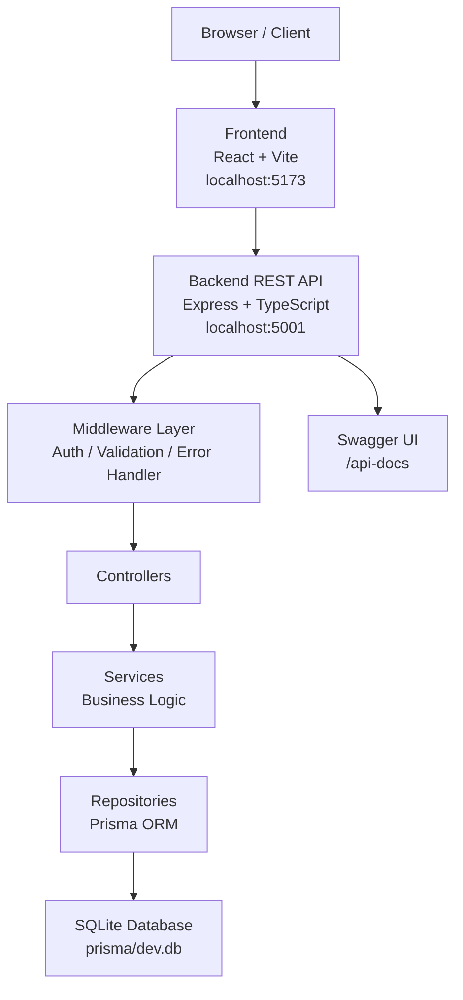
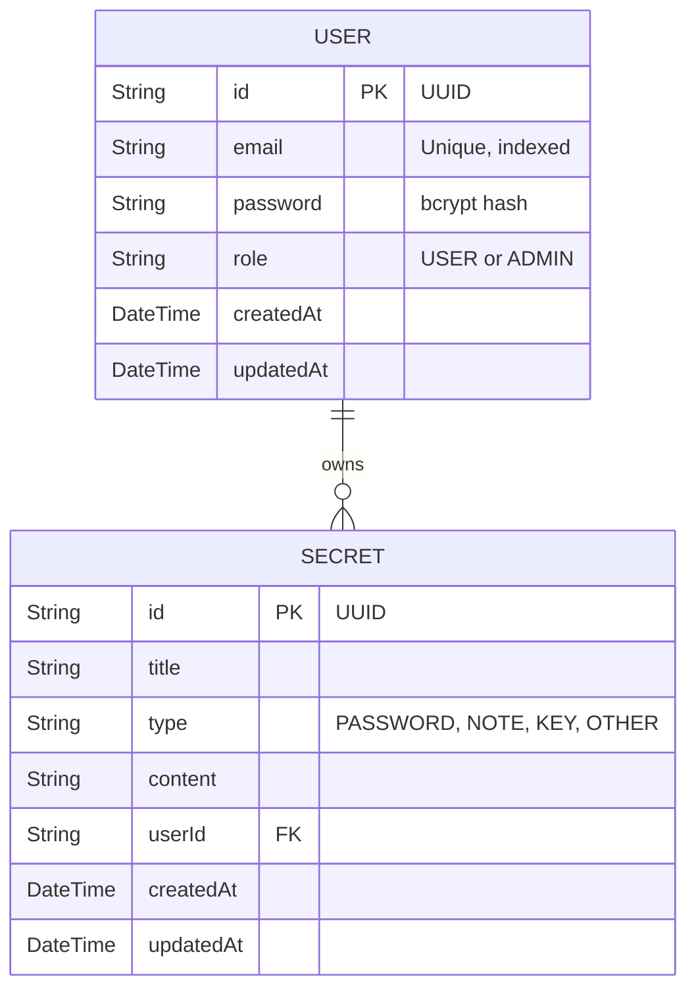
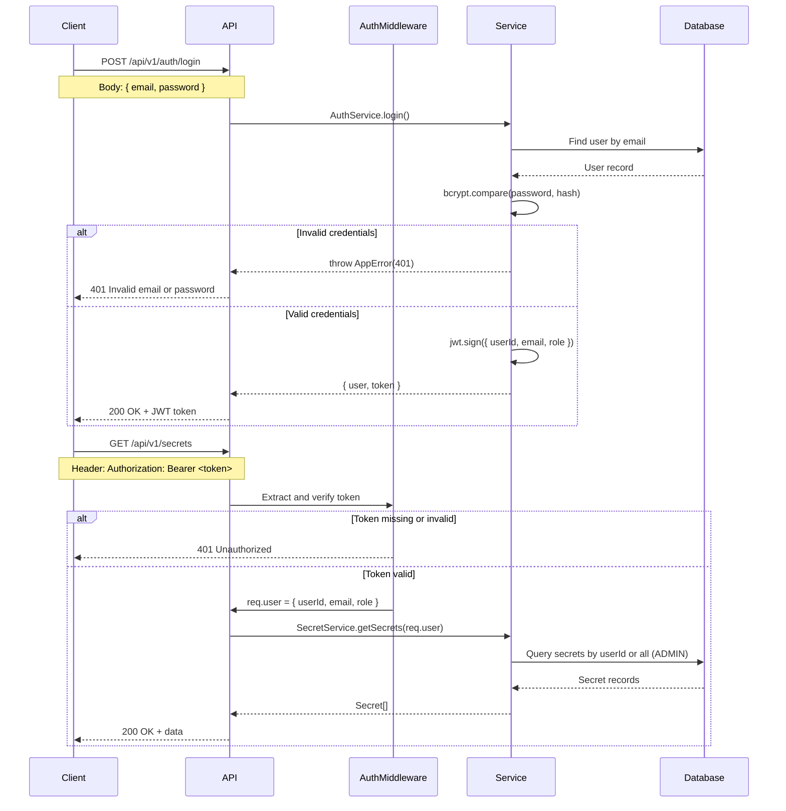
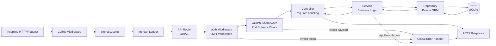
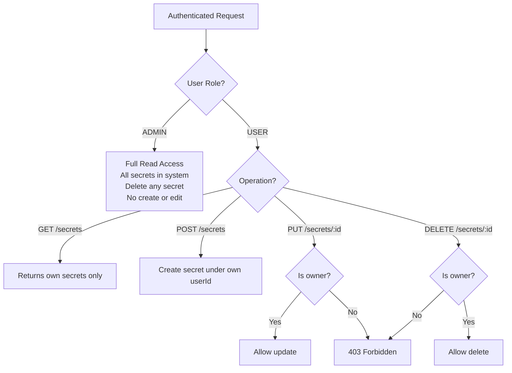
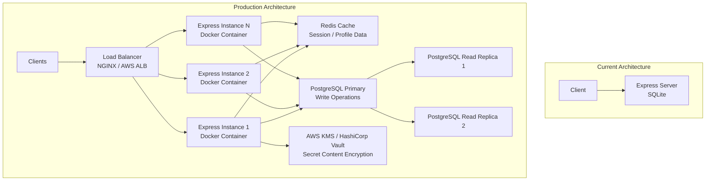

# NodeVault

NodeVault is a secure, scalable REST API system for managing user credentials, encrypted notes, and access keys. It implements stateless JWT authentication, role-based access control (RBAC), a layered TypeScript backend, and a React dashboard frontend.

---

## Table of Contents

- [Architecture Overview](#architecture-overview)
- [Project Structure](#project-structure)
- [Technology Stack](#technology-stack)
- [Database Schema](#database-schema)
- [Authentication Flow](#authentication-flow)
- [Request Lifecycle](#request-lifecycle)
- [API Reference](#api-reference)
- [Role-Based Access Control](#role-based-access-control)
- [Getting Started](#getting-started)
- [Environment Variables](#environment-variables)
- [Test Accounts](#test-accounts)
- [Scalability Design](#scalability-design)

---

## Architecture Overview

NodeVault is organized as a decoupled full-stack monorepo. The backend is a strictly-typed Express.js server structured in layers. The frontend is a React single-page application that communicates exclusively through the REST API.



---

## Project Structure

```
nodevault/
├── backend/
│   ├── prisma/
│   │   ├── schema.prisma          # Database schema and model definitions
│   │   ├── seed.ts                # Database seed script
│   │   └── migrations/            # Auto-generated Prisma migration history
│   ├── src/
│   │   ├── index.ts               # Express app entry point, middleware wiring
│   │   ├── controllers/
│   │   │   ├── auth.controller.ts # Handles auth route requests/responses
│   │   │   └── secret.controller.ts
│   │   ├── services/
│   │   │   ├── auth.service.ts    # Registration, login, profile logic
│   │   │   └── secret.service.ts  # CRUD logic with ownership enforcement
│   │   ├── repositories/
│   │   │   ├── user.repository.ts # Prisma User model queries
│   │   │   └── secret.repository.ts
│   │   ├── middlewares/
│   │   │   ├── auth.ts            # JWT bearer token verification
│   │   │   ├── validate.ts        # Zod schema validation middleware
│   │   │   └── errorHandler.ts    # Global error catch and response formatter
│   │   ├── schemas/
│   │   │   ├── auth.schema.ts     # Zod schemas: register, login
│   │   │   └── secret.schema.ts   # Zod schemas: create, update, get
│   │   ├── routes/
│   │   │   ├── index.ts           # Versioned API router (/api/v1)
│   │   │   ├── auth.routes.ts     # Auth endpoint definitions
│   │   │   └── secret.routes.ts   # Secrets endpoint definitions
│   │   └── utils/
│   │       ├── logger.ts          # Winston structured logger
│   │       ├── jwt.ts             # Token sign and verify helpers
│   │       ├── hash.ts            # bcryptjs password hash and compare
│   │       └── db.ts              # Prisma singleton client
│   ├── .env                       # Environment variables
│   ├── tsconfig.json
│   └── package.json
│
└── frontend/
    ├── src/
    │   ├── App.jsx                # All UI components and routing logic
    │   ├── index.css              # Design system, light/dark theme variables
    │   ├── main.jsx               # React DOM root mount
    │   └── context/
    │       └── AuthContext.jsx    # Auth state, JWT storage, API fetch wrapper
    ├── index.html
    └── package.json
```

---

## Technology Stack

### Backend

| Layer | Technology | Purpose |
| :--- | :--- | :--- |
| Runtime | Node.js v18+ | JavaScript server runtime |
| Language | TypeScript (strict) | Type safety and compile-time validation |
| Framework | Express.js | HTTP routing and middleware |
| ORM | Prisma | Type-safe database client and migrations |
| Database | SQLite | Embedded relational database (swappable to PostgreSQL) |
| Auth | jsonwebtoken | Stateless JWT signing and verification |
| Hashing | bcryptjs | Secure password hashing with salt rounds |
| Validation | Zod | Runtime schema validation for all request payloads |
| Logging | Winston + Morgan | Structured application and HTTP request logging |
| API Docs | swagger-jsdoc + swagger-ui-express | Auto-generated interactive documentation |

### Frontend

| Layer | Technology | Purpose |
| :--- | :--- | :--- |
| Framework | React 18 | Component-based UI rendering |
| Build Tool | Vite | Fast dev server and production bundler |
| Styling | Vanilla CSS | Custom design system with CSS variables |
| State | React Context API | Global auth and token management |
| HTTP | Native Fetch API | REST API communication with bearer auth |

---

## Database Schema

NodeVault uses two relational tables. A `User` has many `Secrets`. Deleting a user cascades deletion to all their secrets.



---

## Authentication Flow

All protected routes require a `Bearer` JWT in the `Authorization` header. Tokens are signed with `HS256` and expire after 24 hours.



---

## Request Lifecycle

Every inbound request passes through a fixed middleware pipeline before reaching business logic.



---

## API Reference

Base URL: `http://localhost:5001/api/v1`

Interactive documentation with live request execution is available at `http://localhost:5001/api-docs`.

### Authentication Endpoints

| Method | Endpoint | Auth Required | Description |
| :--- | :--- | :--- | :--- |
| POST | `/auth/register` | No | Register a new user account |
| POST | `/auth/login` | No | Authenticate and receive a JWT token |
| GET | `/auth/profile` | Yes | Retrieve the authenticated user's profile |

### Secrets Endpoints

| Method | Endpoint | Auth Required | Roles | Description |
| :--- | :--- | :--- | :--- | :--- |
| POST | `/secrets` | Yes | USER | Create a new vault item |
| GET | `/secrets` | Yes | USER, ADMIN | List secrets (own for USER, all for ADMIN) |
| GET | `/secrets/:id` | Yes | USER (owner), ADMIN | Retrieve a specific vault item |
| PUT | `/secrets/:id` | Yes | USER (owner only) | Update a vault item |
| DELETE | `/secrets/:id` | Yes | USER (owner), ADMIN | Delete a vault item |

### Standard Response Shape

All responses follow a consistent JSON envelope:

```json
{
  "success": true,
  "message": "Optional descriptive message",
  "data": {}
}
```

Error responses:

```json
{
  "success": false,
  "error": "Human-readable error message",
  "code": "ERROR_CODE_CONSTANT"
}
```

Validation failure responses include field-level details:

```json
{
  "success": false,
  "error": "Validation failed",
  "details": [
    { "field": "email", "message": "Invalid email address" }
  ]
}
```

---

## Role-Based Access Control



---

## Getting Started

### Prerequisites

- Node.js v18 or higher
- npm v9 or higher

### Backend Setup

```bash
cd backend

# Install dependencies
npm install

# Run database migrations (creates prisma/dev.db)
npx prisma migrate dev --name init

# Seed the database with test accounts and sample data
npx ts-node prisma/seed.ts

# Start the development server with hot reload
npm run dev
```

The API server starts at `http://localhost:5001`.
Swagger documentation is available at `http://localhost:5001/api-docs`.

### Frontend Setup

Open a separate terminal:

```bash
cd frontend

# Install dependencies
npm install

# Start the Vite development server
npm run dev
```

The dashboard is available at `http://localhost:5173`.

### Production Build

```bash
# Backend
cd backend && npm run build
node dist/index.js

# Frontend
cd frontend && npm run build
# Serve the dist/ folder with any static file server
```

---

## Environment Variables

Create a `.env` file in the `backend/` directory with the following variables:

| Variable | Default | Description |
| :--- | :--- | :--- |
| `PORT` | `5001` | Port the Express server listens on |
| `DATABASE_URL` | `file:./dev.db` | Prisma database connection string |
| `JWT_SECRET` | — | Secret key used to sign JWT tokens. Must be changed in production |
| `NODE_ENV` | `development` | Application environment (`development` or `production`) |

To switch to PostgreSQL, change `DATABASE_URL` to a PostgreSQL connection string and update `schema.prisma`:

```prisma
datasource db {
  provider = "postgresql"
  url      = env("DATABASE_URL")
}
```

Then run:

```bash
npx prisma migrate dev --name switch-to-postgres
```

---

## Test Accounts

The seed script creates the following accounts for local development and evaluation:

| Role | Email | Password | Permissions |
| :--- | :--- | :--- | :--- |
| ADMIN | `admin@nodevault.com` | `admin123` | Read and delete all secrets system-wide |
| USER | `user@nodevault.com` | `user123` | Full CRUD on own secrets only |

---

## Scalability Design



### Scaling Recommendations

**Database**
Migrate from SQLite to a managed PostgreSQL cluster (Now implemented using Supabase). Use connection pooling (PgBouncer) for serverless environments to handle high concurrency, and implement read replicas to offload read-heavy traffic.

**Caching**
Introduce a Redis layer for caching frequently accessed secrets or user profiles. Implement a Cache-Aside pattern where results are served from Redis, reducing the load on the primary PostgreSQL database and improving response times (TTFB).

**Horizontal Scaling & Failover**
Since the JWT authentication is stateless, Express server instances can be scaled horizontally across multiple Availability Zones (AZs) behind a Load Balancer (ALB). Deploying as Docker containers managed by Kubernetes (EKS) or ECS allows for automatic health checks and self-healing.

**Security & Encryption at Rest**
Implemented password hashing with bcryptjs (10 rounds) and JWT for stateless auth. For enterprise scaling, implement envelope encryption for secret content using AWS KMS or HashiCorp Vault. This ensures that even in the case of a database breach, individual secrets remain encrypted with unique keys.

**Microservice Migration**
The current layered architecture (Controller -> Service -> Repository) is designed for a clean migration to microservices. The Auth module can be extracted into an independent Identity Provider (IdP), while the Secret module can scale independently to handle heavy CRUD operations.

**Enterprise Logging & Monitoring**
Integrated Winston structured logging for production auditing. For scaling, logs should be aggregated into an ELK stack (Elasticsearch, Logstash, Kibana) or Datadog for real-time alerting on API failures and performance bottlenecks.
